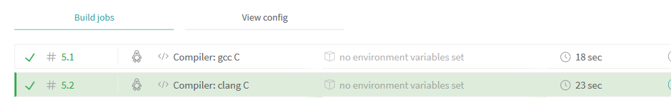

# TravisCItestC
[](https://www.travis-ci.org/LinkinW/TravisCItestC)

学习Travis CI C语言项目的编译打包过程

用.travis.yml文件控制Travis CI持续集成

例子：

```yaml
language: c

compiler:
    - gcc
    - clang

script:
    - make && make test
    - ./example
```
一个编译C的例子

指定编译器gcc和clang，两个编译器都会编译，并显示各自编译的结果，如图：



注意YAML语法:后要加上空格

## 增加TravisCI编译通过标签

在github主页增加一个编译通过的标签。

